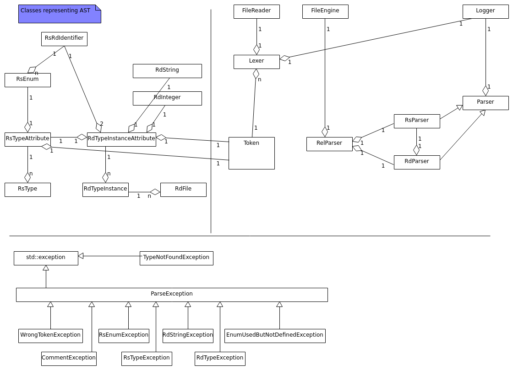

# rel_lib - REL C++ Library

C++ library, that implements REL and is used in different contexts, e.g. for the command line tool, within language server implementation and in python integration.

# How to Build rel_lib

```
bazel build //rel-lib:rel_lib
``` 

# Test Environment

Unit Tests:

```
bazel test //rel-lib/test/unittest:RelLibUnitTest
```

# Software Architecture

## Class Diagram


[Source](./doc/static_class_diagram.uxf)

## [AST](https://en.wikipedia.org/wiki/Abstract_syntax_tree)

All classes that form the AST are defined in [AST.h](./src/AST.h). They are mainly data classes, where the attributes can be accessed directly. Most of them provide a `Get()` method, which returns the main information (in most of the times, this is the name of an entity). Further documentation related to AST can be found in the source code.

## Software Design of Main Classes


### Class Logger

[`Logger`](./src/Logger.h#L20) is a helper class, which enables access to log statements produced by rel_lib. Per default, log statements are sent to stdout, but at construction time, a path to a file can be provided as well. In this case, all log statements are written into the file.

Method [`SetLogLevel()`](./src/Logger.h#L26) can be used to set the [log level](./src/Logger.h#L13). Per default, it is set to WARNING. For debugging purposes, developers can also set it to DBUG, to get log messages for all relevant steps rel_lib is pursuing. Be aware, that setting the highest log level has significant negative impact on performance of the library. Therefore this setting should not be deployed in production environment.

A message is then logged by calling [`LogMessage()`](./src/Logger.h#29). For brevity, macro [LOG()](./src/Logger.h#11) sets the first two parameters to the compiler defines for current file and line.

### Class FileEngine

[`FileEngine`](./src/FileEngine.h#L16) scans the directories provided and extracts the paths to all REL files, namely _.rs_ and _.rd_ files. It uses C++17 `\<filesystem\>` operations. After object creation, properties are set via [`SetDirectory()`](./src/FileEngine.h#L26) and [`SetSearchRecursive()`](./src/FileEngine.h#L23). The first method can be called multiple times and expects an absolute or relative path to a directory, where REL model files are located. With the latter, the developer can control whether all subdirectores shall be traversed or not.
  
By calling [`GetListOfFiles()`](), the actual file system operations are pursued. It returns a vector of `FileTokenData`, which contains an entry for every file identified. `FileTokenData` does not only contain the path to the file - it is also used to store all tokens extracted out of the file.

Note that the files found by `FileEngine` are always ordered alphabetically.


### Class RelParser

`RelParser` is the main entry point of rel_lib. It orchestrates lexing and parsing of all tokens generated. Additionally, it translates exception that happen during parsing into log statements.

If an object of `RelParser` is created, a `Logger` object and a `FileEngine` object has to be provided. With these two input parameters, the developer can inject both external dependencies to `RelParser`, namely the target for log statements and the input source, that shall be processed.

After creation, method `ProcessRelModel()` is used to trigger the REL model generation. This method triggers the whole workflow of lexing, and parsing.

To get the resulting type instances, containing the actual requirements data, method `GetDatabase()` can be called, which returns an vector of `RdTypeInstance`.

## External API

In the previous paragraph, the main classes are described in detail. `Logger`, `FileEngine` and `RelParser` also act as the external API of rel_lib. Within the Python integration, these three classes are exposed to the developer and have to be used, in order to run REL within Python.
